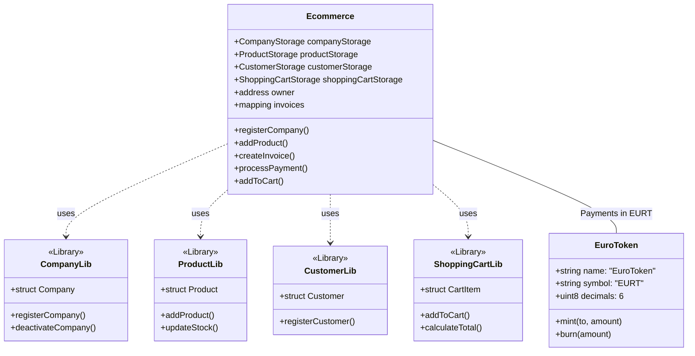

# Euro-Ecommerce Workspace Case Study

Este proyecto es un ecosistema completo de comercio electrónico descentralizado que integra tecnología Blockchain (Solidity/Foundry), una Stablecoin propia (EURT) y pasarelas de pago tradicionales (Stripe) para permitir la compra de productos físicos y digitales utilizando una moneda estable vinculada al Euro.

## 🏗️ Estructura del Workspace

El proyecto está dividido en varios subproyectos interconectados:

1.  **`sc-ecommerce`**: Contratos inteligentes del núcleo del E-commerce.
2.  **`stablecoin/sc`**: Contrato inteligente de la Stablecoin EuroToken (EURT).
3.  **`web-customer`**: Interfaz para el cliente final (Comprador).
4.  **`web-admin`**: Panel de control para administradores y empresas.
5.  **`stablecoin/pasarela-de-pago`**: Microservicio de integración con Stripe.
6.  **`stablecoin/compra-stablecoin`**: Servicio de acuñación (minting) de tokens tras pago Fiat.

---

## 🚀 Funcionalidades por Subproyecto

### 1. Smart Contracts (`sc-ecommerce`)
*   **Gestión de Empresas:** Registro y activación de comercios.
*   **Catálogo de Productos:** CRUD de productos con control de stock on-chain.
*   **Carrito de Compra:** Lógica de persistencia y cálculo de totales en contrato.
*   **Facturación (Invoices):** Generación de facturas únicas vinculadas a pedidos.
*   **Procesamiento de Pagos:** Validación de transacciones y estados (Pending, Completed, Failed, Refunded).
*   **Librerías Modulares:** Uso de `CompanyLib`, `ProductLib`, `CustomerLib` y `ShoppingCartLib` para una arquitectura escalable.

### 2. EuroToken (`stablecoin/sc`)
*   **Estándar ERC20:** Implementación basada en OpenZeppelin.
*   **Precisión:** Configurado con 6 decimales para representar céntimos de Euro.
*   **Control de Emisión:** Funciones de `mint` protegidas por el propietario para emitir tokens tras pagos verificados.

### 3. Web Customer (`web-customer`)
*   **Exploración de Productos:** Catálogo dinámico consumiendo datos del contrato.
*   **Conexión Web3:** Integración con MetaMask.
*   **On-ramp Fiat:** Compra de EURT directamente con tarjeta de crédito/débito.
*   **Checkout:** Proceso de pago utilizando la stablecoin propia.

### 4. Web Admin (`web-admin`)
*   **Dashboard de Gestión:** Vista general de ventas y métricas.
*   **Gestión de Inventario:** Panel para añadir productos y actualizar existencias.
*   **Control de Empresas:** Registro de nuevas entidades en el contrato.

---

## 🛠️ Dependencias Principales

### Blockchain
*   **Foundry:** Framework de desarrollo (Forge, Anvil).
*   **OpenZeppelin:** Contratos estándar de seguridad y tokens.
*   **Solidity 0.8.13+**

### Frontend / Backend
*   **Next.js 14/16:** Framework de React para las aplicaciones web.
*   **Ethers.js (v5/v6):** Interacción con la blockchain.
*   **Tailwind CSS & DaisyUI:** Estilizado y componentes de UI.
*   **Stripe SDK:** Procesamiento de pagos con tarjeta.

---

## 📊 Diagrama de Clases (Arquitectura de Contratos)



---

## 🛠️ Instrucciones de Inicio (Modo Desarrollo)

### Requisitos Previos
*   Node.js v18+ e npm.
*   Foundry (Forge & Anvil).
*   MetaMask en el navegador.
*   Stripe CLI (para pruebas locales de webhooks).

### Paso 1: Levantar la Blockchain Local
```bash
anvil
```

### Paso 2: Despliegue y Configuración Automática
Ejecuta el script de despliegue completo que configurará los contratos y generará los archivos `.env.local` automáticamente:
```bash
./deploy-complete.sh
```

### Paso 3: Iniciar los Servicios Web
Abre diferentes terminales para cada subproyecto:

**Web Customer (Puerto 3030):**
```bash
cd web-customer
npm install
npm run dev
```

**Web Admin (Puerto 3032):**
```bash
cd web-admin
npm install
npm run dev
```

**Pasarela de Pago (Puerto 3034):**
```bash
cd stablecoin/pasarela-de-pago
npm install
npm run dev
```

**Servicio de Compra de Stablecoin (Puerto 3033):**
```bash
cd stablecoin/compra-stablecoin
npm install
npm run dev
```

### Paso 4: Configurar Stripe Webhooks (Opcional para pagos Fiat)
Si vas a probar la compra de tokens con tarjeta:
```bash
stripe listen --forward-to localhost:3034/api/webhook
```

---

## 💡 Caso de Estudio: Flujo de Compra
1.  El usuario entra en **web-customer** y conecta su MetaMask.
2.  Si no tiene saldo, utiliza la funcionalidad "Comprar EURT" (integra Stripe).
3.  El servicio **pasarela-de-pago** procesa el cobro Fiat.
4.  Stripe notifica al **webhook** del éxito.
5.  El servicio **compra-stablecoin** ejecuta un `mint` en el contrato **EuroToken** hacia la wallet del usuario.
6.  El usuario añade productos al carrito y realiza el "Checkout" llamando a `createInvoice` en el contrato **Ecommerce**.
7.  Se firma la transacción y el stock se descuenta automáticamente en la blockchain.