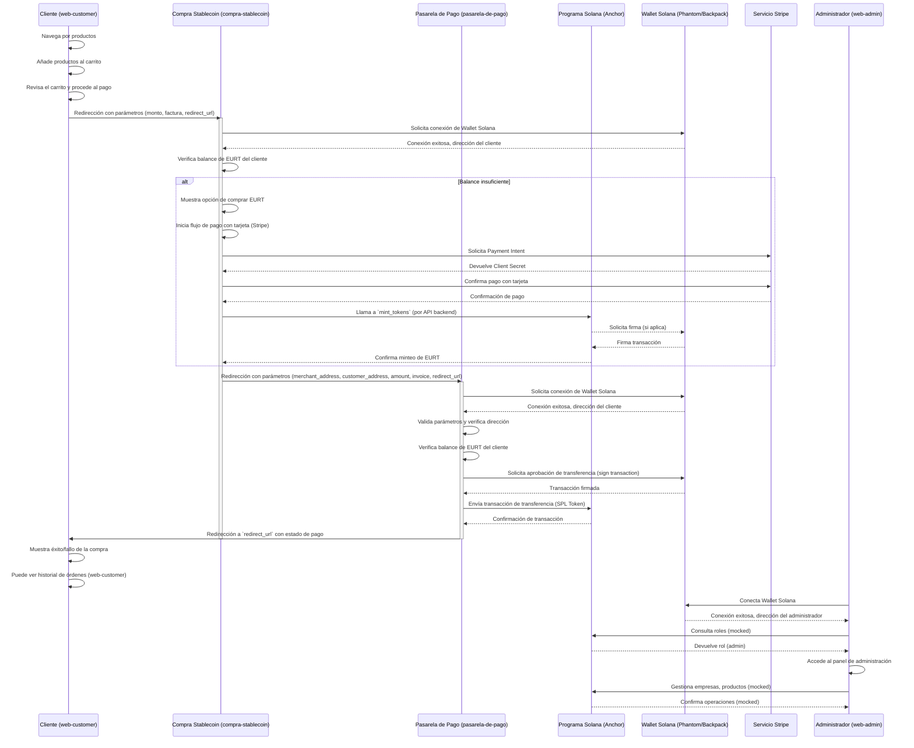

# E-Commerce en Solana: Guía de Migración y Despliegue

## 1. Resumen del Proyecto

Este documento detalla la arquitectura y el proceso de despliegue del proyecto de e-commerce descentralizado, migrado de una infraestructura basada en Ethereum (EVM) a la blockchain de Solana.

El objetivo de esta actualización fue modernizar la plataforma para aprovechar la alta velocidad de transacción y las bajas comisiones de la red de Solana, manteniendo al mismo tiempo la lógica de negocio central, incluyendo la stablecoin `EURT`, las pasarelas de pago y los paneles de administración.

El ecosistema se compone de los siguientes elementos:
*   **Programa Anchor (Smart Contract):** Un único programa en Rust que gestiona la lógica de la stablecoin (`EURT`) como un token SPL.
*   **Interfaces de Usuario (Next.js):**
    *   `web-customer`: La tienda virtual para clientes.
    *   `web-admin`: Panel de administración para gestionar la plataforma.
    *   `compra-stablecoin`: Interfaz para adquirir `EURT` mediante Stripe.
    *   `pasarela-de-pago`: Gateway que procesa los pagos en `EURT`.

## 2. Proceso de Interacción para la Migración

La transición de Ethereum a Solana fue un proceso iterativo y de resolución de problemas. A continuación se describe el flujo de trabajo seguido:

#### a. Análisis y Estrategia Inicial
Se analizaron los contratos `EuroToken.sol` y `Ecommerce.sol` para entender su lógica: un token ERC-20 con 6 decimales y un sistema de roles (`onlyOwner`). Se determinó que en Solana, la funcionalidad se dividiría: el programa Anchor gestionaría la **autoridad de acuñación (mint authority)** de un token SPL, en lugar de contener los balances directamente.

#### b. Desarrollo del Programa Anchor
Se escribió el programa en Rust utilizando el framework Anchor. El desafío inicial fue replicar el `onlyOwner` de Solidity. Se resolvió usando un **PDA (Program Derived Address)** como autoridad de acuñación, garantizando que solo nuestro programa pudiera emitir nuevos tokens `EURT`.

#### c. Migración de las Interfaces de Usuario (UIs)
Esta fue la fase más compleja. Se refactorizaron todos los `hooks` y componentes que interactuaban con la blockchain:
*   Se reemplazó `ethers.js` y `window.ethereum` por el ecosistema **Solana Wallet Adapter**, implementando un `WalletProvider` global y añadiendo soporte para billeteras como **Phantom** y **Backpack**.
*   Se reescribieron todas las llamadas on-chain para usar `@solana/web3.js` y `@coral-xyz/anchor`. Por ejemplo, la consulta de balances pasó de una llamada a `balanceOf()` a obtener la Cuenta de Token Asociada (ATA) y usar `connection.getTokenAccountBalance()`. 

#### d. Depuración y Resolución de Errores
Durante la migración, surgieron varios errores críticos que fueron solucionados de forma incremental:
1.  **Errores de Compilación de Anchor (`E0277`, `E0599`):** El compilador de Rust devolvía errores de `traits` no satisfechos. La solución implicó ajustar las versiones de las dependencias `anchor-lang` y `anchor-spl` y utilizar los tipos de cuenta correctos (`Account` en lugar de `InterfaceAccount`) con las importaciones adecuadas (`anchor_spl::token`).
2.  **Error de Red "Network 1337 not supported":** Las UIs conservaban resquicios de la lógica de Ethereum que validaban el `chainId`. Se eliminó por completo este sistema de validación, haciendo que las aplicaciones dependan únicamente del `RPC_URL` definido en los archivos `.env.local`.
3.  **Conflictos de Build en Next.js:** Se resolvieron errores de compilación relacionados con la falta del componente `<Suspense>` de React y la duplicación de rutas en el App Router.

#### e. Automatización del Despliegue
Finalmente, se reescribió por completo el script `deploy.sh`. El nuevo script automatiza el despliegue en la red de pruebas local **Surfpool**, gestionando la compilación y despliegue del programa Anchor y la generación de todos los archivos `.env.local` con los IDs del programa y la configuración de red correcta.

## 3. Guía de Inicialización y Despliegue Local

Sigue estos pasos para levantar el ecosistema completo en tu entorno de desarrollo.

### Prerrequisitos
Asegúrate de tener instaladas las siguientes herramientas:
*   **Rust** y **Cargo**
*   **Solana CLI** (`solana-cli`)
*   **Anchor Framework** (`avm`)
*   **Node.js** (v18 o superior) y npm/yarn
*   **Surfpool** (para la red de pruebas local)

### Paso 1: Iniciar la Red de Pruebas Local
En una terminal, inicia tu validador local de Surfpool. Este comando dejará la red corriendo:
```bash
surfpool
```

### Paso 2: Ejecutar el Script de Despliegue Automatizado
Este script se encargará de compilar y desplegar el programa de Anchor en tu red local y de configurar todas las variables de entorno de las UIs.

Abre una nueva terminal en la raíz del proyecto y ejecuta:
```bash
/bin/bash deploy.sh
```
El script realizará las siguientes acciones:
1.  Se conectará a tu red local de Solana.
2.  Solicitará un `airdrop` para tener fondos para el despliegue.
3.  Compilará y desplegará el programa Anchor.
4.  Extraerá el **Program ID** y el **IDL** (equivalente al ABI).
5.  Creará y llenará los archivos `.env.local` en todos los proyectos de UI (`web-customer`, `web-admin`, etc.) con las direcciones y configuraciones correctas.

### Paso 3: Instalar Dependencias de las UIs
Ahora, instala las dependencias de todos los proyectos de Next.js.
```bash
# Navega a cada proyecto e instala sus dependencias
for dir in web-admin web-customer solana-stablecoin/compra-stablecoin solana-stablecoin/pasarela-de-pago; do
  echo "📦 Instalando dependencias para $dir..."
  (cd "$dir" && npm install --legacy-peer-deps)
done
```
*Nota: Se usa `--legacy-peer-deps` para resolver conflictos de versiones menores en el ecosistema de React.*

### Paso 4: Iniciar los Servidores de Desarrollo
Finalmente, inicia los servidores de cada aplicación. Cada uno corre en un puerto diferente.

```bash
# Iniciar Web-Customer en el puerto 3030
(cd web-customer && npm run dev) &

# Iniciar Web-Admin en el puerto 3032
(cd web-admin && npm run dev) &

# Iniciar Compra-Stablecoin en el puerto 3033
(cd solana-stablecoin/compra-stablecoin && npm run dev) &

# Iniciar Pasarela-de-Pago en el puerto 3034
(cd solana-stablecoin/pasarela-de-pago && npm run dev) &
```

### ¡Listo! Tu Ecosistema E-Commerce en Solana está Activo
*   **Tienda para Clientes:** `http://localhost:3030`
*   **Panel de Administración:** `http://localhost:3032`
*   **Compra de Stablecoins:** `http://localhost:3033`
*   **Pasarela de Pagos:** `http://localhost:3034`

---

## 4. Flujo de Interacción del Usuario (UI)

Este diagrama de secuencia general describe cómo interactúan los usuarios con las diferentes interfaces y el programa Solana para realizar una compra:



## 5. UML de los Programas Solana

El ecosistema en Solana se centra en un único programa Anchor (`solana-stablecoin/solana`) que gestiona la lógica de la stablecoin EURT y un mock de la funcionalidad de e-commerce.

### 5.1 Programa `solana` (EuroToken y E-commerce Mocks)

```mermaid
classDiagram
    direction LR

    class ProgramState {
        + owner: PublicKey
        + paused: bool
        + total_companies: u64
        + total_products: u64
        + total_customers: u64
        + last_invoice_id: u64
        --
        // Otros estados globales del programa
    }

    class EuroTokenMint {
        + mint_authority: PublicKey (PDA)
        + decimals: u8 = 6
        + supply: u64
        --
        // Representado por la cuenta `Mint` de SPL Token
    }

    class CompanyAccount {
        + id: u64
        + owner: PublicKey
        + name: String
        + description: String
        + is_active: bool
        + created_at: i64
        --
        // Relacionado a `web-admin`
    }

    class ProductAccount {
        + id: u64
        + company_id: u64
        + name: String
        + description: String
        + price: u64 (en unidades base EURT)
        + stock: u64
        + image_url: String
        + is_active: bool
        --
        // Relacionado a `web-admin` y `web-customer`
    }

    class CustomerAccount {
        + address: PublicKey
        + is_registered: bool
        + cart: Vec<CartItem>
        + invoices: Vec<u64> // Lista de IDs de facturas
        --
        // Relacionado a `web-customer`
    }

    class CartItem {
        + product_id: u64
        + quantity: u64
    }

    class InvoiceAccount {
        + id: u64
        + company_id: u64
        + customer_address: PublicKey
        + total_amount: u64 (en unidades base EURT)
        + timestamp: i64
        + is_paid: bool
        + payment_tx_hash: String
        + items: Vec<InvoiceItem>
    }

    class InvoiceItem {
        + product_id: u64
        + product_name: String
        + quantity: u64
        + unit_price: u64
        + total_price: u64
    }

    ProgramState "1" -- "1" EuroTokenMint : Controls
    ProgramState "1" -- "N" CompanyAccount : Manages
    ProgramState "1" -- "N" ProductAccount : Manages
    ProgramState "1" -- "N" CustomerAccount : Manages
    ProgramState "1" -- "N" InvoiceAccount : Manages

    CustomerAccount "1" -- "N" CartItem : Has
    InvoiceAccount "1" -- "N" InvoiceItem : Contains

    class SolanaProgram {
        <<Program>>
        + initialize(ctx)
        + mint_tokens(ctx, amount: u64)
        + burn_tokens(ctx, amount: u64)
        // Mocked E-commerce instructions:
        + register_company(ctx, name: String, desc: String)
        + add_product(ctx, company_id: u64, name: String, desc: String, price: u64, stock: u64, img: String)
        + add_to_cart(ctx, product_id: u64, quantity: u64)
        + create_invoice(ctx, company_id: u64)
        + process_payment_invoice(ctx, invoice_id: u64, tx_hash: String)
    }

    class Initialize {
        <<Accounts>>
        payer: Signer
        mint_authority: UncheckedAccount (PDA)
        mint: Account<Mint>
        token_program: Program<Token>
        system_program: Program<System>
        rent: Sysvar<Rent>
    }

    class MintTokens {
        <<Accounts>>
        mint: Account<Mint>
        mint_authority: UncheckedAccount (PDA)
        destination: Account<TokenAccount>
        payer: Signer
        token_program: Program<Token>
    }

    class BurnTokens {
        <<Accounts>>
        mint: Account<Mint>
        from: Account<TokenAccount>
        authority: Signer
        token_program: Program<Token>
    }

    SolanaProgram ..> Initialize
    SolanaProgram ..> MintTokens
    SolanaProgram ..> BurnTokens
    Initialize --> EuroTokenMint : creates
    MintTokens --> EuroTokenMint : interacts with
    BurnTokens --> EuroTokenMint : interacts with

    Note over SolanaProgram
        Las instrucciones de E-commerce (registro de compañía,
        productos, carrito, etc.) están actualmente
        mockeadas en la capa UI (`useContract` hook)
        y no se implementan completamente on-chain en este programa de ejemplo.
        Sin embargo, se presenta la estructura de datos
        que idealmente tendrían si estuvieran completamente
        en el programa Solana.
    end
```
