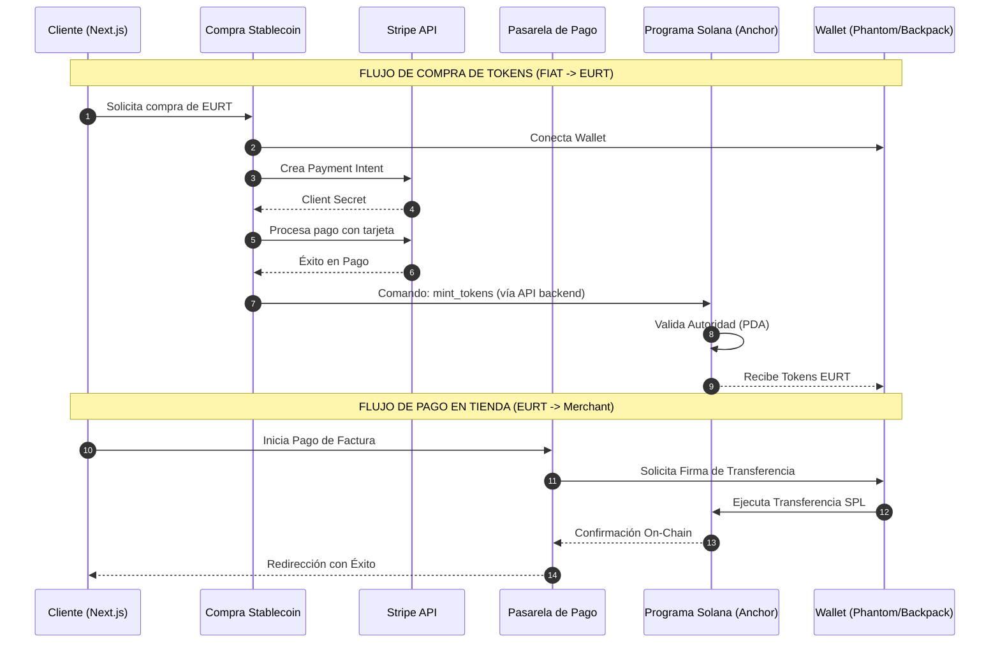
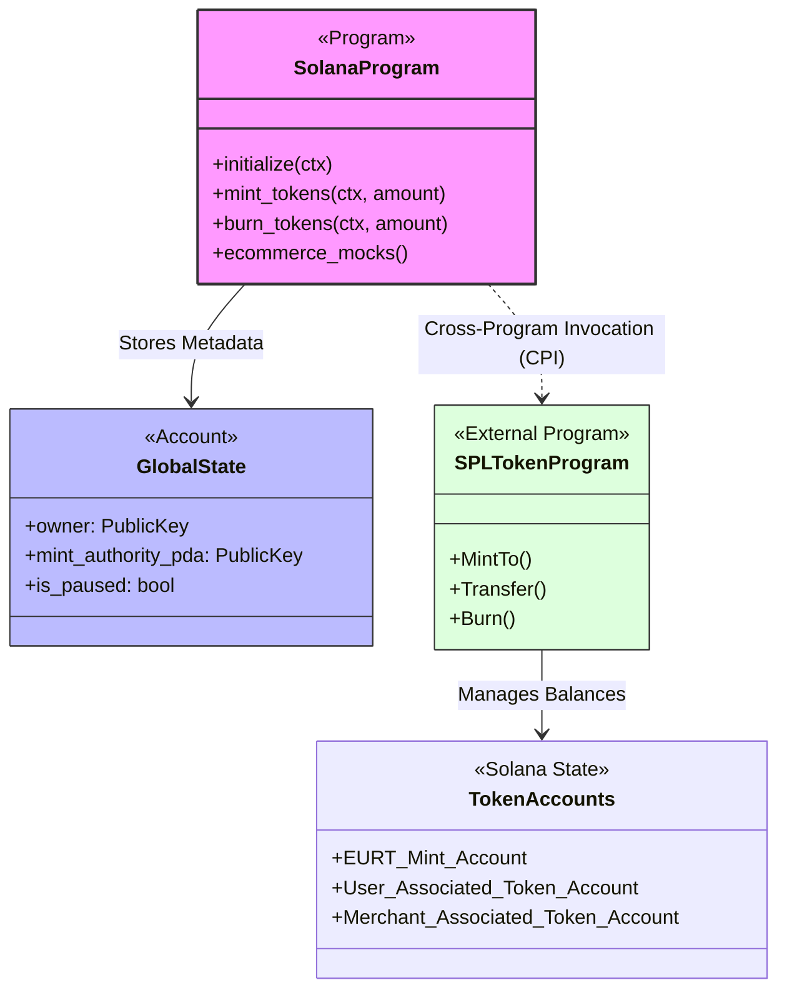
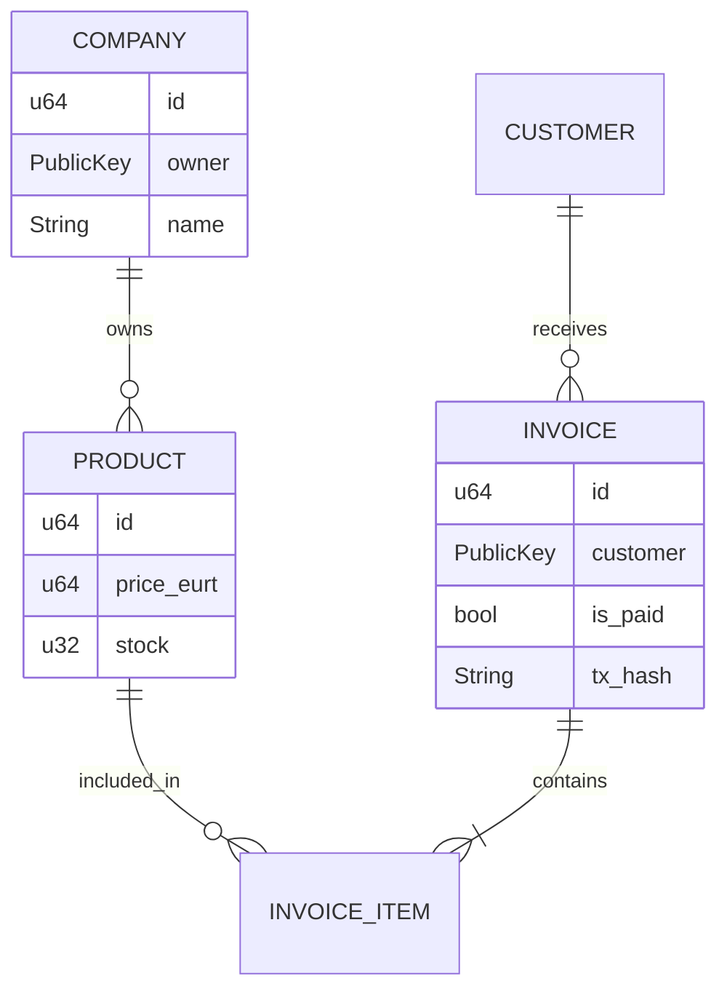

# E-Commerce en Solana: Guía de Migración y Despliegue

## 1. Resumen del Proyecto

Este documento detalla la arquitectura y el proceso de despliegue del proyecto de e-commerce descentralizado, migrado de una infraestructura basada en Ethereum (EVM) a la blockchain de Solana.

El ecosistema se compone de los siguientes elementos:
*   **Programa Anchor (Smart Contract):** Un único programa en Rust que gestiona la lógica de la stablecoin (`EURT`) como un token SPL.
*   **Interfaces de Usuario (Next.js):**
    *   `web-customer`: La tienda virtual para clientes.
    *   `web-admin`: Panel de administración para gestionar la plataforma.
    *   `compra-stablecoin`: Interfaz para adquirir `EURT` mediante Stripe.
    *   `pasarela-de-pago`: Gateway que procesa los pagos en `EURT`.

---

## 2. De Ethereum a Solana: El Proceso de Transformación

La transición de Ethereum a Solana implicó un cambio de paradigma, pasando de un modelo basado en cuentas que ejecutan código y almacenan datos (EVM) a un modelo donde el código (Programas) y los datos (Cuentas) están separados.

### Documentación Detallada de la Migración
Para entender en profundidad los desafíos técnicos y las soluciones aplicadas, consulta los siguientes documentos:
*   [📄 Informe General de Migración](./docs/migracion-ethereum-a-solana.md): Narrativa completa del proceso técnico y decisiones de arquitectura.
*   [📄 Guía de Consistencia](./docs/MIGRATION_AND_CONSISTENCY.md): Registro de cambios específicos en hooks, componentes y validaciones.
*   [📄 Log de Errores y Soluciones](./docs/FIX_LOG_STABLECOIN_ERRORS.md): Detalle de cómo se resolvieron errores críticos como "Non-base58 character" y problemas de CORS.
*   [📄 Detalles Técnicos del Programa](./docs/ETH_TO_SOLANA_MIGRATION_DETAILS.md): Comparativa directa entre Solidity y Anchor.

### Resumen de Cambios Clave
1.  **Stablecoin:** De un contrato `ERC-20` independiente a un **Mint Account** de SPL Token controlado por un **PDA (Program Derived Address)**.
2.  **Seguridad:** Reemplazo del patrón `onlyOwner` de Solidity por una autoridad basada en firmas del programa (CPI).
3.  **Frontend:** Migración completa de `ethers.js` a `@solana/web3.js` y adopción del **Solana Wallet Adapter**.
4.  **Validación:** Eliminación de la dependencia de `chainId` en favor de la validación por `RPC_URL` y direcciones Base58 robustas.

---

## 3. Guía de Inicialización y Despliegue Local

Para una configuración paso a paso detallada, consulta nuestra [**Guía Completa de Instalación**](./docs/INSTALLATION_GUIDE.md).

### Paso 1: Iniciar la Red de Pruebas Local
Inicia tu validador local de Surfpool en una terminal:
```bash
surfpool
```

### Paso 2: Ejecutar el Script de Despliegue
Abre una nueva terminal en la raíz y ejecuta:
```bash
/bin/bash deploy.sh
```
Este script automatiza la compilación, despliegue y generación de archivos `.env.local` para todas las aplicaciones.

### Paso 3: Servidores de Desarrollo
Cada aplicación corre en un puerto diferente:
*   **Web-Customer:** `http://localhost:3030`
*   **Web-Admin:** `http://localhost:3032`
*   **Compra-Stablecoin:** `http://localhost:3033`
*   **Pasarela-de-Pago:** `http://localhost:3034`

---

## 4. Flujo de Interacción del Sistema

El siguiente diagrama describe el flujo de trabajo desde la compra de tokens con tarjeta de crédito hasta la ejecución de un pago en la tienda.



---

## 5. Arquitectura del Programa Solana

El ecosistema se centra en un programa Anchor que actúa como controlador del ecosistema EURT.



### Detalles de Datos (E-Commerce Mocks)
Aunque la lógica de la tienda está actualmente mockeada en el frontend para agilizar la migración, la estructura de datos está preparada para ser persistida on-chain:



---

## 6. Mantenimiento y Solución de Problemas

Si encuentras errores de red o de transacciones:
1.  **Limpia la caché:** `rm -rf .next` en las carpetas de las UIs.
2.  **Reinicia Surfpool:** Cierra el validador y ejecútalo de nuevo para resetear el estado de la blockchain local.
3.  **Redespliega:** Ejecuta `deploy.sh` para regenerar todas las claves y archivos de configuración.
4.  **Consola del Navegador:** Busca logs con prefijos `[VALIDATION]`, `[CONFIRM]` o `[VERIFY-PURCHASE]` para diagnosticar errores de Base58 o CORS.

---
© 2024 E-Commerce Solana Project - Migración de Ethereum a Solana.