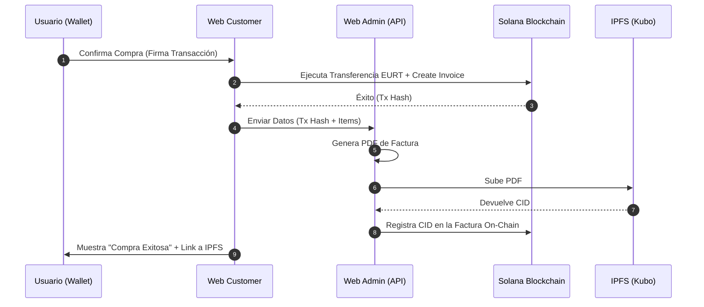
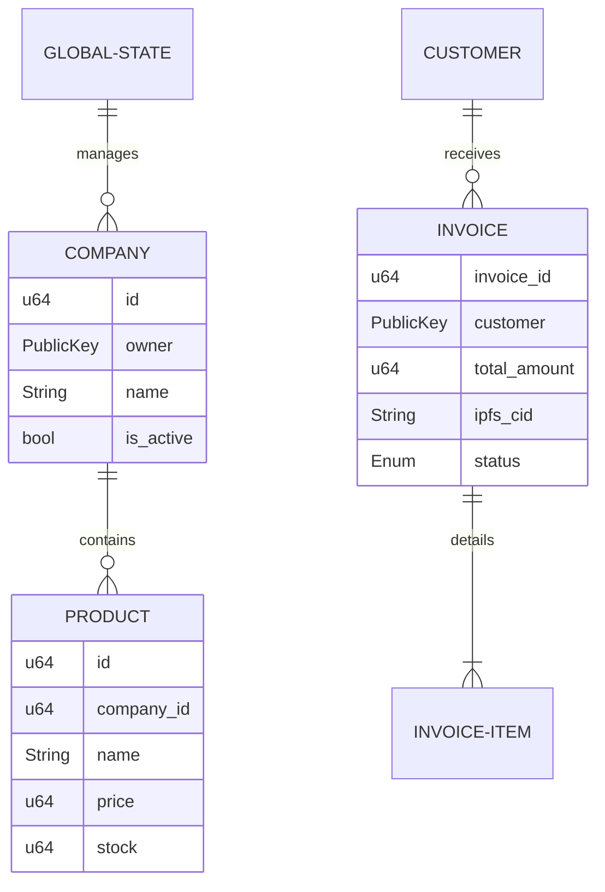

# E-Commerce Solana: Ecosistema Descentralizado de Pagos y Comercio

## 1. Resumen del Proyecto

Este ecosistema representa una solución integral de comercio electrónico construida sobre la blockchain de **Solana**. Originalmente concebido en Ethereum, el sistema ha sido migrado y optimizado para aprovechar la alta velocidad y bajos costos de transacción de Solana, utilizando el framework **Anchor**.

El proyecto permite a los usuarios adquirir una stablecoin propia (**EURT**), realizar compras en una tienda virtual, registrar facturas de forma inmutable en la blockchain y obtener recibos descentralizados a través de **IPFS**.

---

## 2. Arquitectura del Sistema

El sistema se divide en dos programas inteligentes (Smart Contracts) y cuatro aplicaciones front-end interconectadas:

### Programas On-Chain (Rust/Anchor)
*   **`solana-stablecoin`**: Gestiona el token **EURT** (SPL). Utiliza una **PDA (Program Derived Address)** como autoridad de minteo para garantizar la descentralización.
*   **`solana-ecommerce`**: El motor del comercio. Gestiona el registro de empresas, catálogos de productos, carritos de compra de los usuarios y el registro histórico de facturas.

### Aplicaciones Web (Next.js)
*   **`web-customer` (Puerto 3030)**: Interfaz para el cliente final. Catálogo, carrito de compras, pagos on-chain y visualización de recibos IPFS.
*   **`web-admin` (Puerto 3032)**: Panel central para administradores y dueños de empresas. Gestión de inventario, visualización de clientes y API de generación de facturas PDF.
*   **`compra-stablecoin` (Puerto 3033)**: Portal de rampa de entrada (on-ramp) para comprar EURT con FIAT mediante tarjeta de crédito (Stripe).
*   **`pasarela-de-pago` (Puerto 3034)**: Backend procesador de pagos que interactúa con el Smart Contract para el minteo automático tras la confirmación de Stripe.

---

## 3. Flujo de Usuario y Funcionalidades

### Fase 1: Adquisición de Liquidez (Fiat -> EURT)
1.  El usuario conecta su wallet (Phantom/Backpack) en `compra-stablecoin`.
2.  Realiza un pago con tarjeta vía **Stripe**.
3.  Un webhook seguro activa el Smart Contract de Solana.
4.  El programa mintea **EURT** directamente a la wallet del usuario usando la autoridad PDA.

### Fase 2: Experiencia de Compra
1.  En `web-customer`, el usuario navega por productos de distintas empresas.
2.  Agrega productos al carrito (gestión persistida on-chain).
3.  Al pagar, el usuario firma una transacción que transfiere EURT al vendedor y crea una **Invoice** (factura) en la blockchain.

### Fase 3: Facturación e IPFS
1.  Tras el pago, el sistema genera automáticamente un **PDF** con los detalles de la compra.
2.  El PDF se sube a **IPFS** (Kubo) obteniendo un identificador único (CID).
3.  El **CID de IPFS** se guarda en la cuenta de la factura en Solana.
4.  El usuario puede ver su recibo inmutable en cualquier momento desde su historial de órdenes.

---

## 4. Diagramas de Interacción

### Flujo de Pago y Facturación

```mermaid
sequenceDiagram
    autonumber
    participant U as Usuario (Wallet)
    participant WC as Web Customer
    participant WA as Web Admin (API)
    participant BC as Solana Blockchain
    participant IPFS as IPFS (Kubo)

    U->>WC: Confirma Compra (Firma Transacción)
    WC->>BC: Ejecuta Transferencia EURT + Create Invoice
    BC-->>WC: Éxito (Tx Hash)
    WC->>WA: Enviar Datos (Tx Hash + Items)
    WA->>WA: Genera PDF de Factura
    WA->>IPFS: Sube PDF
    IPFS-->>WA: Devuelve CID
    WA->>BC: Registra CID en la Factura On-Chain
    WC->>U: Muestra "Compra Exitosa" + Link a IPFS
```

### Modelo de Datos On-Chain

```mermaid
erDiagram
    GLOBAL-STATE ||--o{ COMPANY : manages
    COMPANY ||--o{ PRODUCT : contains
    CUSTOMER ||--o{ INVOICE : receives
    INVOICE ||--|{ INVOICE-ITEM : details
    
    COMPANY {
        u64 id
        PublicKey owner
        String name
        bool is_active
    }
    PRODUCT {
        u64 id
        u64 company_id
        String name
        u64 price
        u64 stock
    }
    INVOICE {
        u64 invoice_id
        PublicKey customer
        u64 total_amount
        String ipfs_cid
        Enum status
    }
```

---

## 5. Guía de Instalación Rápida

### Requisitos Previos
*   Solana CLI & Anchor Framework.
*   Node.js (v18+) & Yarn/NPM.
*   **Kubo (IPFS)**: Corriendo localmente.

### Configuración del Entorno
1.  **Red Local**: Inicia el validador en una terminal:
    ```bash
    solana-test-validator
    ```
2.  **Despliegue Automático**: Ejecuta el script maestro desde la raíz:
    ```bash
    ./deploy.sh
    ```
    *Este script compila los contratos, los despliega, inicializa el Mint de EURT y configura todos los archivos `.env.local` automáticamente.*

3.  **Configurar IPFS**: Habilita CORS en tu nodo Kubo para permitir subidas desde el navegador/backend:
    ```bash
    ipfs config --json API.HTTPHeaders.Access-Control-Allow-Origin '["*"]'
    ```

4.  **Iniciar Aplicaciones**:
    Entra en cada carpeta (`web-customer`, `web-admin`, etc.) y ejecuta:
    ```bash
    npm run dev
    ```

---

## 6. Documentación Adicional
*   [📄 Resumen de Cambios de Migración](./docs/SUMMARY_CHANGES_MIGRATION.md): Por qué y cómo pasamos de Ethereum a Solana.
*   [📄 Guía de Implementación IPFS](./docs/IPFS_IMPLEMENTATION_GUIDE.md): Detalles técnicos sobre la facturación descentralizada.
*   [📄 Guía de Instalación Completa](./docs/INSTALLATION_GUIDE.md): Paso a paso detallado para nuevos desarrolladores.

---
© 2024 E-Commerce Solana Project - Innovación en Pagos Descentralizados.