# Flujo de Pagos Descentralizado: Integración Wallet y Smart Contract

Este documento describe la arquitectura y el ciclo de vida de una transacción de pago en la plataforma E-Commerce sobre Solana, utilizando el token EURT (SPL-Token) como moneda de cambio nativa.

## 1. Arquitectura del Pago (SPL-Token Transfer)

El sistema de pagos de la plataforma se basa en la transferencia directa y _peer-to-peer_ (P2P) de tokens entre la billetera del cliente y la del comercio.
Esto elimina intermediarios y reduce significativamente las comisiones, además de garantizar la liquidación casi instantánea de los fondos gracias a la velocidad de la blockchain de Solana.

### Características Clave:
*   **Token**: EuroToken (`EURT`), configurado con 6 decimales.
*   **Instrucción Base**: `TransferChecked` del programa oficial de Solana SPL Token.
*   **Validación de Cuentas (ATAs)**: Creación dinámica de cuentas asociadas para asegurar que el receptor pueda almacenar el token.

---

## 2. Ciclo de Vida de la Transacción (Diagrama de Secuencia)

El siguiente diagrama detalla cómo interactúa el Frontend (React/Next.js) con la Wallet del Usuario (ej. Backpack, Phantom) y la red de Solana (Surfpool/Mainnet) paso a paso:

```mermaid
sequenceDiagram
    autonumber
    actor Usuario
    participant Frontend as Web App (useContract.ts)
    participant Wallet as Extensión Wallet (Backpack/Phantom)
    participant Solana as Red Solana (RPC)
    
    Usuario->>Frontend: Clic en "Pagar con EURT"
    
    rect rgb(30, 41, 59)
    Note over Frontend, Solana: 1. PREPARACIÓN Y VALIDACIÓN ON-CHAIN
    Frontend->>Solana: Consulta ATAs de EURT (Comprador y Vendedor)
    Solana-->>Frontend: Retorna info de cuentas
    Frontend->>Frontend: Valida que el comprador tenga saldo suficiente
    end
    
    alt Si el Vendedor NO tiene ATA de EURT
        rect rgb(15, 23, 42)
        Note over Frontend, Solana: 1.1. INICIALIZACIÓN DEL VENDEDOR (Automática)
        Frontend->>Solana: getLatestBlockhash
        Solana-->>Frontend: Retorna blockhash
        Frontend->>Wallet: Solicita firma para instrucc. "Create ATA"
        Wallet-->>Frontend: Firma devuelta
        Frontend->>Solana: Envía transacción (Create ATA)
        Solana-->>Frontend: Confirmación de creación
        end
    end
    
    rect rgb(30, 41, 59)
    Note over Frontend, Solana: 2. CONSTRUCCIÓN DE LA TRANSFERENCIA
    Frontend->>Frontend: Construye instrucción "TransferChecked"
    Frontend->>Solana: getLatestBlockhash ("confirmed")
    Solana-->>Frontend: Retorna blockhash y feePayer
    Frontend->>Frontend: Ensambla la Transaction completa
    end
    
    rect rgb(15, 23, 42)
    Note over Frontend, Solana: 3. AUTORIZACIÓN Y ENVÍO (Desacoplado)
    Frontend->>Wallet: sendTransaction (skipPreflight: true)
    Note right of Wallet: El popup se abre para el usuario
    Usuario->>Wallet: Aprueba la transacción
    Wallet->>Solana: Envía la transacción firmada a la red cruda
    Wallet-->>Frontend: Retorna el Hash de inmediato (Signature)
    end
    
    rect rgb(30, 41, 59)
    Note over Frontend, Solana: 4. CONFIRMACIÓN Y ACTUALIZACIÓN UI
    Frontend->>Solana: confirmTransaction(signature, "confirmed")
    Note right of Frontend: Polling activo contra el RPC local
    Solana-->>Frontend: Bloque procesado (Status: Success)
    Frontend->>Frontend: Dispara evento "refresh-eurt-balance"
    Frontend->>Usuario: Muestra Recibo Digital (Hash) y redirige
    end
```

---

## 3. Problemas Detectados y Soluciones de Ingeniería

Durante la integración con las billeteras (especialmente en entornos de desarrollo local como Surfpool), se presentaron varios bloqueos técnicos que impedían completar el pago. A continuación se detallan las causas fundamentales y cómo se refactorizó el código para solucionarlas:

### Error 1: "AccountNotInitialized" o "InvalidAccountData" (-32002)
*   **Síntoma**: La transacción fallaba inmediatamente al simularse en la red.
*   **Causa Raíz**: 
    1. El contrato intentaba transferir EURT hacia la `PublicKey` base del vendedor, en lugar de su **ATA (Associated Token Account)**. 
    2. El vendedor a menudo no poseía una ATA creada en la red de prueba para ese token específico.
*   **Solución Aplicada**: 
    - Se modificó `processPayment` para derivar automáticamente las ATAs usando `getAssociatedTokenAddress`.
    - Se incluyó un chequeo pre-vuelo: si `connection.getAccountInfo(merchantAta)` es nulo, el frontend orquesta y envía una transacción independiente con la instrucción `createAssociatedTokenAccountInstruction` *antes* de intentar la transferencia.

### Error 2: Pagos Fantasmas (Éxito en red, pero sin descuento de saldo)
*   **Síntoma**: El log del RPC mostraba la instrucción `TransferChecked` como exitosa, pero el saldo de la UI y de la billetera no disminuía.
*   **Causa Raíz**: En entornos de desarrollo, el desarrollador suele usar la misma billetera para actuar como "Comercio" y como "Cliente". Una transferencia a la misma cuenta ATA se procesa como un *no-op* válido en la EVM de Solana.
*   **Solución Aplicada**: 
    - Se añadió una "Protección Local" en el hook. Si `merchantPubKey.equals(publicKey)`, la transacción redirige los fondos a una cuenta "dummy" de quemado (`1111...`) temporalmente para que el descuento del balance sea observable y testeable en la UI.

### Error 3: Cuelgue de la Billetera ("Plugin Closed" / WalletSendTransactionError)
*   **Síntoma**: El usuario hacía clic en Pagar, la ventana de Backpack aparecía por un instante y luego la UI arrojaba el error "Plugin Closed" o "Maximum update depth exceeded", dejando la aplicación congelada.
*   **Causa Raíz (Condición de Carrera)**: El frontend delegaba demasiada responsabilidad a la extensión de la billetera. Al llamar a `sendTransaction` sin parámetros, la billetera intentaba pedir el *blockhash*, simular la transacción contra el RPC local y firmarla, todo de forma síncrona. Si el RPC local era muy rápido o si la UI de React se re-renderizaba en ese milisegundo (debido a actualizaciones de estado del carrito), el puente de comunicación con la extensión se rompía, provocando el cierre abrupto del "Plugin".
*   **Solución Definitiva (Desacoplamiento de Responsabilidades)**:
    1.  **Pre-cálculo en la Web**: La aplicación web (`useContract.ts`) ahora pide el `getLatestBlockhash` y asigna el `feePayer` *antes* de invocar a la billetera.
    2.  **`skipPreflight: true`**: Se ordenó a la billetera que envíe la transacción firmada "a ciegas" a la red, saltándose la simulación local de la extensión (que era inestable).
    3.  **Confirmación Manual**: En lugar de esperar que la promesa de la billetera haga la confirmación final, el frontend toma el hash devuelto casi de inmediato y realiza su propio *polling* seguro usando `connection.confirmTransaction`.

### Error 4: Sincronización del Balance (Flickering de UI)
*   **Síntoma**: Tras un pago exitoso, el contador del Header superior seguía mostrando el saldo antiguo durante 10-15 segundos (hasta el siguiente ciclo de polling).
*   **Solución Aplicada**: Se implementó una arquitectura basada en eventos (Event Bus). Al confirmar exitosamente una transacción, `processPayment` dispara `window.dispatchEvent(new Event("refresh-eurt-balance"))`. El hook `useEuroTokenBalance` escucha este evento e invalida su caché local al instante, repintando el Header en tiempo real para una UX de nivel "bancario".

---
*Este documento refleja el estado de la arquitectura Web3 implementada en `web-customer/src/hooks/useContract.ts` v2.0.*